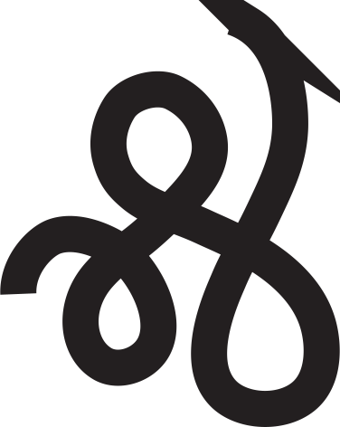

<h1>👋 Hi there, <b>Raghav</b> this side.</h1>
<h2>CSE Student - Web Development Enthusiast</h2>
<h3>Designer🖌 Musicophille🎷 Foodie🍕 Peripatetic🚲</h3>
 

<!-------------------------------------------------------------------------->

### Connect With Me 👉🏼

&nbsp;&nbsp;&nbsp;&nbsp; [][mail]&nbsp;&nbsp;&nbsp; [][linkedin]

 

 
<!-------------------------------------------------------------------------->

<b>Tools & Technologies I use<b>
  

[][html5]&nbsp;&nbsp;&nbsp;
[][css3]&nbsp;&nbsp;&nbsp;
[][bootstrap]&nbsp;&nbsp;&nbsp;
[][javascript]&nbsp;&nbsp;&nbsp;
[][node.js]&nbsp;&nbsp;&nbsp;
[][git]&nbsp;&nbsp;&nbsp;
[][github]&nbsp;&nbsp;&nbsp;
[][java]&nbsp;&nbsp;&nbsp;
[][python]&nbsp;&nbsp;&nbsp;  
[][r]&nbsp;&nbsp;&nbsp;
[][vscode]&nbsp;&nbsp;&nbsp;
[][popos]&nbsp;&nbsp;&nbsp;
[][ai]&nbsp;&nbsp;&nbsp;
[][mysql]&nbsp;&nbsp;&nbsp;
[][mongodb]&nbsp;&nbsp;&nbsp;
[][wp]&nbsp;&nbsp;&nbsp;

 

 

<!-------------------------------------------------------------------------->

<b>I’m currently learning 👉🏼<b>
  

[][next.js]&nbsp;&nbsp;&nbsp;
[][react]&nbsp;&nbsp;&nbsp;
[][tailwindcss]&nbsp;&nbsp;&nbsp;
[][inkscape]&nbsp;&nbsp;&nbsp;

 

 

<!-------------------------------------------------------------------------->

<b>I’m currently working on 👉🏼<b>

 

 

 

<!-------------------------------------------------------------------------->

<b>I’m looking to collaborate on 👉🏼<b>

 

 

 

<!-------------------------------------------------------------------------->

<!------------------------------Links--------------------------------------->

[mail]: mailto:12301raghavgoyal@gmail.com
[linkedin]: www.linkedin.com/in/12301raghavgoyal
[html5]: https://developer.mozilla.org/en-US/docs/Web/Guide/HTML/HTML5
[css3]: https://www.w3schools.com/css/
[bootstrap]: https://getbootstrap.com/
[tailwindcss]: https://tailwindcss.com/
[javascript]: https://javascript.info/
[node.js]: https://nodejs.org/en/
[react]: https://reactjs.org/
[next.js]: https://nextjs.org/
[git]: https://git-scm.com/
[github]: https://github.com/
[java]: https://www.java.com/en/
[python]: https://www.python.org/
[r]: https://www.r-project.org/
[vscode]: https://code.visualstudio.com/docs
[popos]: https://pop.system76.com/
[ai]: https://helpx.adobe.com/support/illustrator.html?promoid=YSYYG8WM&mv=other
[inkscape]: https://inkscape.org/
[mysql]: https://www.mysql.com/
[mongodb]: https://www.mongodb.com/2
[wp]: https://wordpress.org/

<!--
**rg12301/rg12301** is a ✨ _special_ ✨ repository because its `README.md` (this file) appears on your GitHub profile.

Here are some ideas to get you started:

- 🔭 I’m currently working on ...
- 🌱 I’m currently learning ...
- 👯 I’m looking to collaborate on ...
- 🤔 I’m looking for help with ...
- 💬 Ask me about ...
- 📫 How to reach me: ...
- 😄 Pronouns: ...
- ⚡ Fun fact: ...
-->
