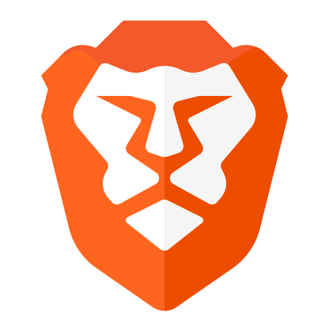

 
 
 

<!---------------------------------- HERO ----------------------------------->

<!-- Logo -->
[][rg]
<!--  -->

<b>Hey! welcome to my profile. I am a CSE Student & passionate Web3 developer 

[][mail]&nbsp;&nbsp;&nbsp;
[][twitter]&nbsp;&nbsp;&nbsp;
[][linkedin]

<!-------------------------------------------------------------------------->

 
 
 

<!------------------------------ More about me ------------------------------->

More about me

 

### **What do I do and What I have done?**

I am pursuing my Bachelor of Technology focused in Computer Science and Engineering from JK Lakshmipat University, Jaipur. I am an intermediate developer skilled in Fullstack Development using Javascript and its frameworks(primarily React.js). My activities are much beyond my stream of education. I love playing outdoors, cycling, and running(also swimming occasionally). I love connecting with people from varied fields, learning & collaborating & contributing to their work.

Web3 and blockchain are something that I can never get bored of and am always excited to talk about. Yes, I am thrilled about it not just because it's fascinating but also because it belongs to my era. It is something I'll be storytelling to my children. I have created two NFT projects and participated in many global hackathons to learn more and crack bounties.

 

### **Projects I made and maintain with 💜 & ✨**

- [OpenShelf | OpenDesk](https://github.com/OpenShelf-OpenDesk)
- [Dapp Tools](https://github.com/Erroders/dapp-tools)

 

### **Tech stack & Tools I use**

 

[][javascript]&nbsp;&nbsp;&nbsp;
[][python]&nbsp;&nbsp;&nbsp;
[][rust]&nbsp;&nbsp;&nbsp;
[][next.js]&nbsp;&nbsp;&nbsp;
[][react]&nbsp;&nbsp;&nbsp;
[][tailwindcss]&nbsp;&nbsp;&nbsp;
[][inkscape]&nbsp;&nbsp;&nbsp;
[][git]&nbsp;&nbsp;&nbsp;
[][github]&nbsp;&nbsp;&nbsp;
[][vscode]&nbsp;&nbsp;&nbsp;
[][popos]&nbsp;&nbsp;&nbsp;

 

[][brave]&nbsp;&nbsp;&nbsp;
[][ethereum]&nbsp;&nbsp;&nbsp;
[][polygon]&nbsp;&nbsp;&nbsp;
[][solidity]&nbsp;&nbsp;&nbsp;
[][metamask]&nbsp;&nbsp;&nbsp;
[][openzeppelin]&nbsp;&nbsp;&nbsp;
[][the-graph]&nbsp;&nbsp;&nbsp;
[][superfluid-finance]&nbsp;&nbsp;&nbsp;
[][superfluid-finance]&nbsp;&nbsp;&nbsp;
[][superfluid-finance]&nbsp;&nbsp;&nbsp;

 

<!-------------------------------------------------------------------------->

### **I’m currently...**

- working on my portfolio website
- learning Inkscape
- learning Rust and advancing in Solidity smart contracts development

 
<!-------------------------------------------------------------------------->

### **People I follow**

- cooking (follow [Chef Raneer Brar](https://www.youtube.com/c/ChefRanveer))
- gardening (follow [Amlaan Baag](https://www.youtube.com/c/AmlaanBaag))
- many experienced developers and their blogs to improve my skills daily

 

<!------------------------------Links--------------------------------------->
[rg]: www.github.com/rg12301
[mail]: mailto:12301raghavgoyal@gmail.com
[linkedin]: https://www.linkedin.com/in/rg12301/
[twitter]: https://twitter.com/rg12301

[javascript]: https://javascript.info/
[python]: https://www.python.org/
[rust]: https://www.rust-lang.org/
[next.js]: https://nextjs.org/
[react]: https://reactjs.org/
[tailwindcss]: https://tailwindcss.com/
[inkscape]: https://inkscape.org/
[git]: https://git-scm.com/
[github]: https://github.com/
[vscode]: https://code.visualstudio.com/docs
[popos]: https://pop.system76.com/

[brave]: https://brave.com/
[ethereum]: https://ethereum.org/en/
[polygon]: https://polygon.technology/
[solidity]: https://soliditylang.org/
[metamask]: https://metamask.io/
[openzeppelin]: https://www.openzeppelin.com/
[the-graph]: https://thegraph.com/en/
[superfluid-finance]: https://www.superfluid.finance/home
[solana]: https://solana.com/
[near]: https://near.org/

<!-------------------------------------------------------------------------->
